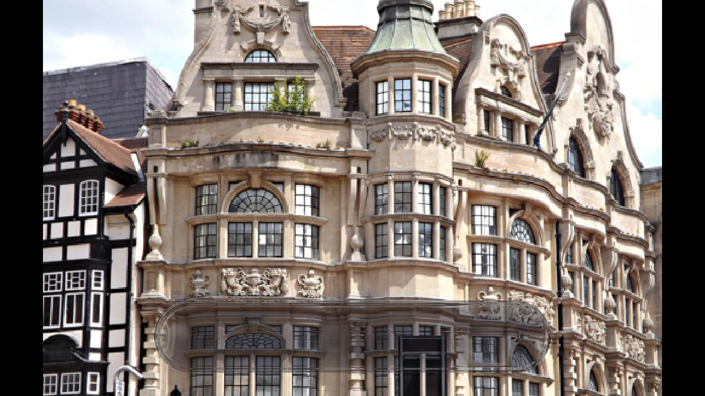
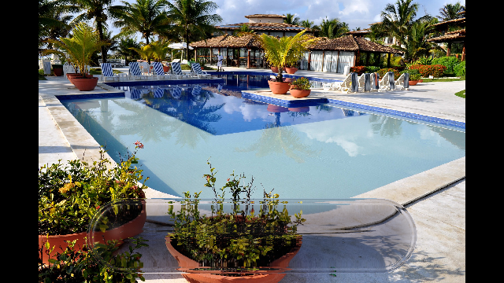
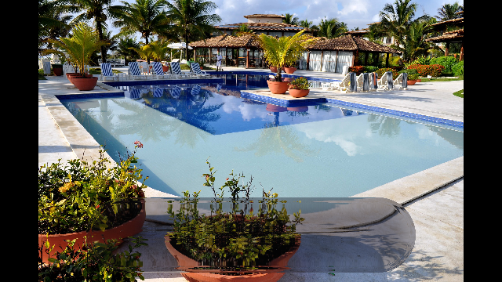
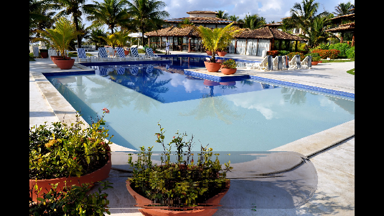

# Liquid Glass Renderer

This project is a Liquid Glass renderer. Although Apple has not released the source code, we constructed a complete mathematical-physical-rendering method model based on Liquid Glass refraction, reflection, highlights, local edge flip-over, legibility adaptation, and real-time rendering behavior, and implemented real-time rendering.

**Results Showcase**

|||||
|---|---|---|---|
|Static Image||||
|Dynamic Real-Time Rendering||||

## 1.Overview

We model Liquid Glass as a **time-varying screen-space optical material system**.
The system inputs are:
1. The composited background content;
2. The 2D shape and hierarchical relations of the glass controls;
3. Control state, touch state, scroll state, and pose/motion state;
4. The legibility requirements of foreground icons and text.

The system outputs are:
1. Dynamic refraction inside the glass region;
2. Fresnel-type reflection and specular highlights along the glass boundary;
3. Motion-coupled highlight drift;
4. Adaptive transmission/tinting/edge enhancement based on background luminance and contrast;
5. The final composited result after temporal stabilization.

Our method treats the Liquid Glass material as being composed of the following five coupled subsystems:

$$
\mathcal{M}_{LG}=
\bigl(
\mathcal{G},\mathcal{O},\mathcal{S},\mathcal{A},\mathcal{T}
\bigr),
$$

where:

* $\mathcal{G}$: geometric subsystem (thickness field, normal field, boundary field);
* $\mathcal{O}$: optical subsystem (refraction, reflection, specular term);
* $\mathcal{S}$: state subsystem (scrolling, touch, pose, merge/separation);
* $\mathcal{A}$: adaptation subsystem (legibility, adaptive light/dark behavior, accessibility constraints);
* $\mathcal{T}$: temporal subsystem (smoothing, anti-flicker, stabilization).

The final material output is

$$
L_{\text{final}}(\mathbf{x},t)=
\mathcal{R}\left(
B,\,G,\,F,\,\mathbf{m},\,\theta
\right),
$$

where $B$ is the background, $G$ is the glass geometry, $F$ is the foreground content, $\mathbf{m}$ is the dynamic state, and $\theta$ is the adaptive parameter set.

## 2.Symbol Table

The global symbol table is given below.

| Symbol                                                 | Meaning |
| ------------------------------------------------------ | ------- |
| $\Omega \subset \mathbb{R}^2$                          | Screen-space domain |
| $\mathbf{x}=(x,y)\in\Omega$                            | Screen pixel coordinate |
| $t$                                                    | Time |
| $G\subset\Omega$                                       | Region covered by a Liquid Glass control |
| $M_G(\mathbf{x})\in[0,1]$                              | Glass region mask |
| $B(\mathbf{x},t)\in\mathbb{R}^3$                       | Background color field |
| $F(\mathbf{x},t)\in\mathbb{R}^3$                       | Foreground icon/text color field |
| $M_F(\mathbf{x})\in[0,1]$                              | Foreground mask |
| $d(\mathbf{x})$                                        | Signed distance function to the glass boundary |
| $\rho(\mathbf{x})$                                     | Distance to the glass medial axis/skeleton |
| $R(\mathbf{x})$                                        | Local radius scale |
| $r(\mathbf{x})=\rho(\mathbf{x})/R(\mathbf{x})$         | Normalized local radius |
| $h(\mathbf{x},t)$                                      | Glass thickness field |
| $\phi(r)$                                              | Thickness profile function |
| $\mathbf{n}(\mathbf{x},t)\in\mathbb{R}^3$              | Glass normal |
| $\eta(\mathbf{x},t)$                                   | Refractive index |
| $\mu=\eta_{\text{air}}/\eta$                           | Relative refractive index |
| $\mathbf{v}(t)\in\mathbb{R}^3$                         | Viewing direction |
| $\mathbf{l}(t)\in\mathbb{R}^3$                         | Virtual light direction |
| $\mathbf{t}(\mathbf{x},t)\in\mathbb{R}^3$              | Refracted direction |
| $\Delta(\mathbf{x},t)\in\mathbb{R}^2$                  | Screen-space refractive displacement |
| $F_{\Delta}(\mathbf{x})=\mathbf{x}+\Delta(\mathbf{x})$ | Background sampling map |
| $J_F(\mathbf{x})$                                      | Mapping Jacobian |
| $\sigma_a(\mathbf{x},t)\in\mathbb{R}^3$                | Absorption coefficient |
| $T(\mathbf{x},t)\in\mathbb{R}^3$                       | Transmission coefficient |
| $L_T,L_R,L_S$                                          | Transmission, reflection, and specular terms |
| $F_r$                                                  | Fresnel reflection term |
| $\alpha(\mathbf{x},t)$                                 | Roughness |
| $\theta(\mathbf{x},t)$                                 | Adaptive control parameter |
| $Y(\cdot)$                                             | Luminance operator |
| $C(\cdot)$                                             | Contrast operator |
| $\mathcal{N}(\mathbf{x})$                              | Local neighborhood of a pixel |
| $\mathbf{m}(t)$                                        | Motion/pose/scroll state vector |
| $\lambda\in(0,1]$                                      | Temporal smoothing parameter |
| $\gamma$                                               | Target contrast threshold |
| $\varepsilon$                                          | Numerical regularization term |


## 3.Geometry: Thickness Field, Boundary Field, and Normal Field

### 3.1.Implicit Glass Geometry

For each glass control region $G$, define its 2D shape function $s(\mathbf{x})$ and boundary signed distance field

$$
d(\mathbf{x})=
\begin{cases}
-\operatorname{dist}(\mathbf{x},\partial G), & \mathbf{x}\in G,\\
\operatorname{dist}(\mathbf{x},\partial G), & \mathbf{x}\notin G.
\end{cases}
$$

To represent the thickness of “Liquid Glass,” we define a time-varying thickness field:

$$
h(\mathbf{x},t)=
h_0(t)\phi\bigl(r(\mathbf{x})\bigr)m_g(\mathbf{x},t)\chi_G(\mathbf{x}),
$$

where:

* $h_0(t) > 0$ is the global thickness scale;
* $\phi(r)$ is the radial profile;
* $m_g(\mathbf{x},t)$ is the geometric modulation term;
* $\chi_G$ is the region indicator function.

To support capsule shapes, rounded rectangles, spherical buttons, and grouped fused boundaries, $r(\mathbf{x})$ should not be fixed as the Euclidean distance to a single center point. Instead, it should be defined as the normalized distance to the medial axis/skeleton:

$$
r(\mathbf{x})=
\frac{\rho(\mathbf{x})}{R(\mathbf{x})},
\qquad
\rho(\mathbf{x})=\operatorname{dist}(\mathbf{x},\mathcal{S}_G),
$$

where $\mathcal{S}_G$ is the control skeleton.

Thus, for a capsule bar, the middle segment is described by a line-segment skeleton and the two end caps are described by disk skeletons; for a circular button, a center-point skeleton can be used directly.

### 3.2.Thickness Profiles

We consider a general profile:

$$
\phi:[0,1]\to[0,1],\qquad \phi\in C^2([0,1]),
$$

satisfying:

$$
\phi(0)=1,\qquad \phi(1)=0,\qquad \phi'(r)\le 0.
$$

Common instances include:

- Parabolic profile

$$
\phi_{\text{par}}(r)=1-r^2.
$$

- Superquadric profile

$$
\phi_{\text{sup}}(r)=\left(1-r^p\right)^q,\qquad p,q>1.
$$

- Edge-roll profile

$$
\phi_{\text{roll}}(r)=
(1-r^2) + a\exp\left(-\frac{(1-r)^2}{2\sigma_r^2}\right),
$$

where $a>0$ is used to enhance edge bulging.

To prevent excessive distortion at the center while strengthening edge highlights, an additional edge weight can be introduced:

$$
w_e(\mathbf{x})=
\psi\bigl(d(\mathbf{x})\bigr),
$$

where $\psi$ can be taken as

$$
\psi(d)=\exp\left(-\frac{d^2}{2\sigma_d^2}\right)
\quad \text{or} \quad
\psi(d)=\operatorname{smoothstep}(a,b,-d).
$$

### 3.3.Normal Field

Treat the glass as a height-field surface on the screen:

$$
S(\mathbf{x},t)=\bigl(x,y,h(\mathbf{x},t)\bigr),
$$

then its unnormalized normal is

$$
\tilde{\mathbf{n}}(\mathbf{x},t)=
\left(
-\partial_x h(\mathbf{x},t),
-\partial_y h(\mathbf{x},t),
1
\right).
$$

The normalized normal is

$$
\mathbf{n}(\mathbf{x},t)=
\frac{\tilde{\mathbf{n}}(\mathbf{x},t)}
{|\tilde{\mathbf{n}}(\mathbf{x},t)|}.
$$

When $|\nabla h|$ increases, edge optical effects become stronger; therefore, the visual core of “Liquid Glass” is not mere transparency, but rather **lens behavior driven by the normal field**.

## 4.Optics: Refraction, Reflection, and Specular Response

### 4.1 Refracted Direction

Let the viewing direction be $\mathbf{v}(t)$, satisfying $|\mathbf{v}(t)|=1$.
Let the refractive index of air be $\eta_a$, and the local refractive index of the glass be $\eta_g(\mathbf{x},t)$. Define the relative refractive index

$$
\mu(\mathbf{x},t)=\frac{\eta_a}{\eta_g(\mathbf{x},t)}.
$$

Let the incident direction be $-\mathbf{v}$. According to the vector form of Snell’s law, the refracted direction is

$$
\mathbf{t}(\mathbf{x},t)=
\mu(-\mathbf{v})+
\left[
\mu(\mathbf{n}\cdot\mathbf{v})-
\sqrt{1-\mu^2\left(1-(\mathbf{n}\cdot\mathbf{v})^2\right)}
\right]\mathbf{n}.
$$

If the term under the square root is negative, it corresponds to a total-internal-reflection approximation, in which case the reflection term can dominate.

### 4.2.Screen-Space Refraction Mapping

In real UI systems, screen-space resampling is often performed in the compositor, so we define the background sampling map

$$
\mathbf{u}'(\mathbf{x},t)=
\mathbf{u}(\mathbf{x})+\Delta(\mathbf{x},t),
$$

where $\mathbf{u}(\mathbf{x})$ is the original background sampling coordinate and $\Delta$ is the refractive displacement field.

A physically inspired form is

$$
\Delta(\mathbf{x},t)=
\kappa_rh(\mathbf{x},t)\Pi\bigl(\mathbf{t}_{xy}(\mathbf{x},t)\bigr),
$$

where $\Pi$ denotes projection onto the screen plane and $\kappa_r$ is a scale parameter.

A form more suitable for real-time implementation is

$$
\Delta(\mathbf{x},t)= k_r
\psi_r\bigl(d(\mathbf{x})\bigr)
\mathbf{n}_{xy}(\mathbf{x},t)+k_c
\psi_c\bigl(r(\mathbf{x})\bigr)
\nabla h(\mathbf{x},t)
$$

where:

* The first term corresponds to edge-dominated normal refraction;
* The second term corresponds to lens displacement caused by the thickness gradient from center to edge;
* $\psi_r,\psi_c$ are modulation functions.

The final transmission sample is

$$
B_r(\mathbf{x},t)=B\left(\mathbf{u}'(\mathbf{x},t),t\right).
$$

### 4.3.Transmission Term

The transmission term is defined as

$$
L_T(\mathbf{x},t)=
T(\mathbf{x},t)\odot B_r(\mathbf{x},t),
$$

where $\odot$ denotes channel-wise multiplication.

Absorption follows a Beer-Lambert-style relation:

$$
T(\mathbf{x},t)=
\exp\bigl(-\sigma_a(\mathbf{x},t),h(\mathbf{x},t)\bigr).
$$

If system-level color adaptation is considered, define the effective transmission as

$$
T_{\text{eff}}(\mathbf{x},t)=
A_{\text{leg}}(\mathbf{x},t)\odot
\exp\bigl(-\sigma_a h\bigr),
$$

therefore

$$
L_T(\mathbf{x},t)=
T_{\text{eff}}(\mathbf{x},t)\odot B_r(\mathbf{x},t).
$$

### 4.4.Reflection and Fresnel Term

Define

$$
c(\mathbf{x},t)=\max(0,\mathbf{n}(\mathbf{x},t)\cdot \mathbf{v}(t)).
$$

Using the Schlick approximation, the Fresnel term is

$$
F_r(\mathbf{x},t)=
F_0 + (1-F_0)(1-c)^5,
$$

where

$$
F_0=
\left(
\frac{\eta_g-\eta_a}{\eta_g+\eta_a}
\right)^2.
$$

The reflection term is

$$
L_R(\mathbf{x},t)=
F_r(\mathbf{x},t)E(\mathbf{x},t),
$$

where $E$ is an environment-reflection approximation or an edge-highlight base.

To enhance the glass contour, an additional contour-enhancement term can be defined:

$$
L_E(\mathbf{x},t)=
k_e
\psi_e\bigl(d(\mathbf{x})\bigr)
F_r(\mathbf{x},t)
c_e(\mathbf{x},t)
$$

where $c_e$ is the edge color or glow color.

### 4.5.Specular Term

To balance physical plausibility and real-time performance, we provide two forms.

**Physically based microfacet model**

Define the half vector

$$
\mathbf{h}_m=
\frac{\mathbf{l}+\mathbf{v}}{|\mathbf{l}+\mathbf{v}|}.
$$

Then the specular term is

$$
L_S(\mathbf{x},t)=
\frac{
D(\mathbf{n},\mathbf{h}_m,\alpha)
G(\mathbf{n},\mathbf{v},\mathbf{l},\alpha)
F_r(\mathbf{v},\mathbf{h}_m)
}{
4(\mathbf{n}\cdot\mathbf{v})(\mathbf{n}\cdot\mathbf{l})+\varepsilon
}
L_i(t).
$$

**UI engineering highlight model**

Define the highlight weight

$$
s(\mathbf{x},t)=
\operatorname{smoothstep}\left(
a_s,b_s,
q(\mathbf{x},t)
\right),
$$

where

$$
q(\mathbf{x},t)=
\mathbf{n}(\mathbf{x},t)\cdot \mathbf{l}(t)+
\beta_e\psi_e(d(\mathbf{x}))+
\beta_m m_s(\mathbf{x},t).
$$

Then

$$
L_S(\mathbf{x},t)=
k_s(t)s(\mathbf{x},t)C_s(t).
$$

Here:

* $m_s$ may include scroll velocity, pose state, or touch state;
* $C_s$ is the highlight color, usually close to white;
* $k_s$ is the time-dependent intensity.

## 5.State-Coupled Motion Model

The glass is not a static material; it is coupled to motion. Define the state vector

$$
\mathbf{m}(t)=
\Bigl(
\mathbf{R}(t),
\mathbf{a}(t),
\boldsymbol{\omega}(t),
\mathbf{p}(t),
\dot{\mathbf{p}}(t),
\mathsf{scroll}(t),
\mathsf{touch}(t),
\mathsf{merge}(t)
\Bigr),
$$

where:

* $\mathbf{R}(t)$: pose rotation;
* $\mathbf{a}(t)$: acceleration;
* $\boldsymbol{\omega}(t)$: angular velocity;
* $\mathbf{p}(t)$: control position;
* $\dot{\mathbf{p}}(t)$: control velocity;
* $\mathsf{scroll}(t)$: scrolling state;
* $\mathsf{touch}(t)$: touch/press state;
* $\mathsf{merge}(t)$: group merge or separation state.

Let the virtual light direction be driven by the state:

$$
\mathbf{l}(t)=\mathcal{L}(\mathbf{m}(t)).
$$

At the same time, thickness, edge intensity, and highlight intensity are also modulated by the state:

$$
h_0(t)=h_{\text{base}} + \delta_h(\mathbf{m}(t)),
$$

$$
k_r(t)=k_{r,\text{base}}+\delta_r(\mathbf{m}(t)),
$$

$$
k_s(t)=k_{s,\text{base}}+\delta_s(\mathbf{m}(t)),
$$

thus the material acquires a dynamic optical quality that changes with motion.

## 6.Local Image Flip and Fold-Over Analysis

This section is the core mathematical part of the method.

### 6.1.Sampling Map

Define the background sampling map

$$
F(\mathbf{x},t)=\mathbf{x}+\Delta(\mathbf{x},t).
$$

Its Jacobian is

$$
J_F(\mathbf{x},t)=I+\nabla \Delta(\mathbf{x},t).
$$

The local orientation of the image, area scaling, and whether a flip occurs are determined entirely by $J_F$.

### 6.2.One-Dimensional Flip Condition

We first give the 1D prototype result.

**Proposition 1 (One-Dimensional Local Flip Condition)**

Let $f:\mathbb{R}\to\mathbb{R}$ be defined as

$$
f(x)=x+\delta(x),
\qquad \delta\in C^1.
$$

If at some point $x_0$,

$$
f'(x_0)=1+\delta'(x_0)<0,
$$

then within a neighborhood of $x_0$, the mapping direction is reversed; that is, points ordered from left to right on the screen are mapped to positions ordered from right to left in the background, and the local image undergoes a mirror-like flip.

**Proof**

Since $f'(x_0)<0$ and $f'$ is continuous, there exists $\epsilon>0$ such that for all $x\in(x_0-\epsilon,x_0+\epsilon)$,

$$
f'(x)<0.
$$

Therefore, $f$ is strictly monotonically decreasing in that neighborhood.
Let $x_1<x_2$ and $x_1,x_2\in(x_0-\epsilon,x_0+\epsilon)$, then

$$
f(x_1)>f(x_2).
$$

This means that the left-to-right order on the screen is reversed in the background sampling space, and therefore the local image orientation flips. Q.E.D.

### 6.3.Two-Dimensional Fold-Over Condition

**Theorem 1 (Two-Dimensional Local Flip and Fold-Over Condition)**

Let $F:\mathbb{R}^2\to\mathbb{R}^2$ be a $C^1$ mapping,

$$
F(\mathbf{x})=\mathbf{x}+\Delta(\mathbf{x}).
$$

If at $\mathbf{x}_0$,

$$
\det J_F(\mathbf{x}_0)<0,
$$

then $F$ undergoes a local orientation flip in a neighborhood of $\mathbf{x}_0$.
If

$$
\det J_F(\mathbf{x}_0)=0,
$$

then $\mathbf{x}_0$ is a singular point of the mapping, local compressive degeneration occurs, and fold-over or caustic-like phenomena may arise.
If

$$
\det J_F(\mathbf{x}_0)>0
\quad \text{and} \quad
\lambda_{\min}(J_F(\mathbf{x}_0))<0,
$$

then local mirrored stretching occurs along some principal direction, but whether the overall orientation flips still depends on the other eigen-direction.

**Proof**

The orientation of a local 2D mapping is determined by the sign of the determinant of the Jacobian matrix.
When $\det J_F(\mathbf{x}_0)<0$, the linearized mapping

$$
F(\mathbf{x}_0+\mathbf{h})
\approx
F(\mathbf{x}_0)+J_F(\mathbf{x}_0)\mathbf{h}
$$

is an orientation-reversing linear mapping, so the orientation of small area elements in the neighborhood is flipped.
When $\det J_F(\mathbf{x}_0)=0$, the linear approximation degenerates, is no longer locally invertible, and flattening, overlap, or folding occurs.
The third case corresponds to compressive flipping along an eigen-direction, but the overall area orientation is determined by the sign of the determinant. Q.E.D.

### 6.4.Sufficient No-Flip Condition

**Theorem 2 (Sufficient Condition for No Flip)**

Let $\Delta\in C^1(\Omega,\mathbb{R}^2)$. If for all $\mathbf{x}\in\Omega$,

$$
|\nabla \Delta(\mathbf{x})|_2 < 1,
$$

then the mapping

$$
F(\mathbf{x})=\mathbf{x}+\Delta(\mathbf{x})
$$

is locally invertible everywhere in $\Omega$, and no local orientation flip occurs.

**Proof**

By matrix perturbation theory, if

$$
|\nabla\Delta(\mathbf{x})|_2<1,
$$

then all eigenvalues $\lambda_i$ of the matrix

$$
J_F(\mathbf{x})=I+\nabla\Delta(\mathbf{x})
$$

satisfy

$$
\operatorname{Re}(\lambda_i)>0.
$$

Therefore, $J_F$ is nonsingular.
More specifically, let $\sigma_{\min}$ be the minimum singular value, then

$$
\sigma_{\min}(J_F)\ge 1-|\nabla\Delta|_2>0.
$$

Hence $J_F$ is invertible everywhere. Since the perturbation is continuous and is obtained by continuous deformation from the identity matrix, it does not cross the singular set $\det=0$, and therefore preserves positive orientation and does not produce local flips. Q.E.D.

### 6.5.Boundary Intensification Proposition

**Proposition 2 (Fold-Over Occurs More Easily Near the Boundary)**

Let

$$
\Delta(\mathbf{x})=k_r\psi(d(\mathbf{x}))\mathbf{n}_{xy}(\mathbf{x}),
$$

where $\psi$ varies most rapidly near the boundary, and $\mathbf{n}_{xy}$ is determined by the thickness field $h$.
If $|\nabla h|$ and $|\psi'(d)|$ attain local maxima within the boundary band $\mathcal{B}*\delta={\mathbf{x}:|d(\mathbf{x})|<\delta}$, then $|\nabla\Delta|$ is larger in that band, and therefore local flipping or fold-back occurs preferentially in the boundary region.

**Proof**

Differentiate $\Delta$:

$$
\nabla\Delta=
k_r\Bigl[
\psi(d)\nabla \mathbf{n}_{xy}
+
\psi'(d)\mathbf{n}_{xy}\otimes \nabla d
\Bigr].
$$

Therefore

$$
|\nabla\Delta|
\le
k_r\Bigl(
|\psi(d)||\nabla \mathbf{n}_{xy}|
+
|\psi'(d)||\mathbf{n}_{xy}||\nabla d|
\Bigr).
$$

Within the boundary band, $|\psi'(d)|$ is maximal, and $\mathbf{n}_{xy}$ and $\nabla\mathbf{n}_{xy}$ also typically increase as curvature rises, so $|\nabla\Delta|$ preferentially reaches larger values in the boundary band. By Theorem 1, fold-over occurs first at the boundary. Q.E.D.


## 7.Legibility-Constrained Adaptive Material

A real system-level glass material must satisfy legibility constraints.

### 7.1.Luminance and Contrast

Define the RGB luminance operator

$$
Y(\mathbf{c}) = 0.2126,c_r + 0.7152,c_g + 0.0722,c_b.
$$

For the background neighborhood, define the local mean luminance

$$
\bar{Y}_B(\mathbf{x},t)=
\frac{1}{|\mathcal{N}(\mathbf{x})|}
\int_{\mathcal{N}(\mathbf{x})}
Y(B(\mathbf{u},t)),d\mathbf{u}.
$$

Define the local luminance variance

$$
V_B(\mathbf{x},t)=
\frac{1}{|\mathcal{N}(\mathbf{x})|}
\int_{\mathcal{N}(\mathbf{x})}
\left(
Y(B(\mathbf{u},t))-\bar{Y}_B(\mathbf{x},t)
\right)^2
d\mathbf{u}.
$$

Define the foreground luminance as $Y_F(\mathbf{x},t)=Y(F(\mathbf{x},t))$.

If the glass base output is $L_G(\mathbf{x},t)$, then the Weber/Michelson-style contrast between foreground and glass base can be written as

$$
C_{\text{fg-bg}}(\mathbf{x},t)=
\frac{|Y_F(\mathbf{x},t)-Y(L_G(\mathbf{x},t))|}
{Y(L_G(\mathbf{x},t))+\varepsilon}.
$$

Require

$$
C_{\text{fg-bg}}(\mathbf{x},t)\ge \gamma,
$$

where $\gamma>0$ is the target threshold.

### 7.2.Adaptive Parameterization

Define the adaptive parameter vector

$$
\theta(\mathbf{x},t)=
\bigl(
\tau,\beta,\zeta,\xi,\nu
\bigr),
$$

where:

* $\tau$: transmission strength;
* $\beta$: tint strength;
* $\zeta$: extra haze/diffusion strength;
* $\xi$: edge-line enhancement strength;
* $\nu$: specular suppression or enhancement strength.

Let the glass base color be

$$
L_G(\mathbf{x},t;\theta)=
\tau L_T
+
(1-\tau)\beta C_t
+
L_R
+
\nu L_S
+
\xi L_E
+
\zeta L_D,
$$

where $C_t$ is the glass base color and $L_D$ is the extra diffusion term.


### 7.3.Legibility-Constrained Optimization

For each pixel or tile, solve

$$
\min_{\theta}E_{\text{mat}}(\theta)+
\lambda_c E_{\text{contrast}}(\theta)+
\lambda_s E_{\text{stability}}(\theta)
$$

where:

$$
E_{\text{mat}}(\theta)=
w_\tau(\tau-\tau_0)^2+
w_\beta(\beta-\beta_0)^2+
w_\zeta(\zeta-\zeta_0)^2+
w_\xi(\xi-\xi_0)^2+
w_\nu(\nu-\nu_0)^2,
$$

$$
E_{\text{contrast}}(\theta)=
\Bigl[
\gamma - C_{\text{fg-bg}}(\mathbf{x},t;\theta)
\Bigr]_+^2,
$$

$$
E_{\text{stability}}(\theta)=
|\theta(\mathbf{x},t)-\theta(\mathbf{x},t-\Delta t)|^2.
$$

Here $[z]_+=\max(0,z)$.

Thus, the adaptive material both preserves the “glass feel” as much as possible, satisfies the minimum contrast constraint, and avoids temporal jitter.

### 7.4.Contrast Feasibility Theorem

**Theorem 3 (Legibility Feasibility)**

Suppose $L_G(\theta)$ is continuous with respect to $\tau$, and its luminance $Y(L_G(\theta))$ covers an interval $I\subset\mathbb{R}_+$ over $\tau\in[\tau_{\min},\tau_{\max}]$. If there exists $y^\star\in I$ such that

$$
\frac{|Y_F-y^\star|}{y^\star+\varepsilon}\ge \gamma,
$$

then there exists some $\tau^\star\in[\tau_{\min},\tau_{\max}]$ such that the contrast constraint can be satisfied.

**Proof**

By continuity, the mapping

$$
\tau \mapsto Y(L_G(\tau))
$$

is continuous on the closed interval, so its image is the interval $I$.
If there exists $y^\star\in I$ satisfying the contrast constraint, then there exists $\tau^\star$ such that

$$
Y(L_G(\tau^\star))=y^\star.
$$

Substituting it yields

$$
\frac{|Y_F-Y(L_G(\tau^\star))|}{Y(L_G(\tau^\star))+\varepsilon}\ge\gamma.
$$

Therefore, the constraint is feasible. Q.E.D.

This theorem indicates that as long as the system allows a sufficiently wide range of transmission/tint adjustment, text legibility can be recovered under many backgrounds.


## 8.Temporal Stabilization

To avoid flicker and abrupt jumps during scrolling, tilting, and touch interaction, we apply temporal smoothing to states and material parameters.

For any dynamic variable $q_t$, define exponential smoothing:

$$
q_t^\star=
(1-\lambda)q_{t-1}^\star+\lambda q_t.
$$

Applied to:

* $\mathbf{l}(t)$: highlight direction;
* $k_r(t)$: refraction strength;
* $k_s(t)$: highlight strength;
* $\theta(t)$: legibility adaptation parameter;
* $\Delta(\mathbf{x},t)$: displacement field;
* $L_G(\mathbf{x},t)$: final base color.

Furthermore, an acceleration suppression term can be added:

$$
q_t^\star=
q_{t-1}^\star
+
\lambda_v (q_t-q_{t-1}^\star)
+
\lambda_a (q_t-2q_{t-1}^\star+q_{t-2}^\star),
$$

to reduce high-frequency oscillation.

## 9.Final Rendering Equation

Combining all the terms above, the color in the glass region is defined as

$$
L_{\text{glass}}(\mathbf{x},t)=
w_T(\mathbf{x},t)L_T(\mathbf{x},t)
+
w_R(\mathbf{x},t)L_R(\mathbf{x},t)
+
w_S(\mathbf{x},t)L_S(\mathbf{x},t)
+
L_E(\mathbf{x},t)
+
L_D(\mathbf{x},t),
$$

satisfying

$$
w_T,w_R,w_S\ge 0,
\qquad
w_T+w_R+w_S\le 1.
$$

Then composite through the region mask:

$$
L_{\text{comp}}(\mathbf{x},t)=
M_G(\mathbf{x})L_{\text{glass}}(\mathbf{x},t)
+
(1-M_G(\mathbf{x}))B(\mathbf{x},t).
$$

Finally overlay the foreground elements:

$$
L_{\text{final}}(\mathbf{x},t)=
(1-M_F(\mathbf{x}))L_{\text{comp}}(\mathbf{x},t)
+
M_F(\mathbf{x})F(\mathbf{x},t).
$$

If the foreground is also affected by glass-material interaction, one can further define foreground projection, shadow, glow, and edge adaptation, but here it is kept as an independent foreground layer for now.


## 10.Real-Time Shader / Render Pipeline

Below is a **runnable real-time pipeline design**.
It does not depend on a specific platform API and can be mapped to Metal / Vulkan / OpenGL ES / DirectX / WebGPU.

### 10.1.Render Pass Decomposition

Each frame executes the following stages:

#### Pass 0: Background Capture

Acquire the background buffer behind the glass

$$
B_t \leftarrow \texttt{BackgroundColorBuffer}.
$$

If the system is a multi-layer compositor, then this is the already composited result below the glass layer.


#### Pass 1: Geometry Field Generation

Generate the following from the control shape:

* mask $M_G$
* signed distance field $d(\mathbf{x})$
* skeleton distance $\rho(\mathbf{x})$
* local radius $R(\mathbf{x})$
* thickness $h(\mathbf{x},t)$

Namely:

$$
(M_G,d,\rho,R,h)_t
\leftarrow
\mathcal{G}_{\text{build}}(G_t,\mathbf{m}(t)).
$$

#### Pass 2: Normal and Refraction Field

Compute normals and displacement from the thickness field:

$$
\mathbf{n}_t=
\mathcal{N}(h_t),
\qquad
\Delta_t=
\mathcal{D}(h_t,\mathbf{n}_t,\mathbf{m}(t)).
$$

And optionally compute an approximate Jacobian intensity map for fold-over control:

$$
J_t(\mathbf{x})=I+\nabla\Delta_t(\mathbf{x}).
$$

#### Pass 3: Optical Shading

Compute:

* transmission $L_T$
* reflection $L_R$
* specular highlight $L_S$
* edge glow $L_E$

Namely

$$
(L_T,L_R,L_S,L_E)_t=
\mathcal{O}(B_t,h_t,\mathbf{n}_t,\Delta_t,\mathbf{m}(t)).
$$

#### Pass 4: Legibility Adaptation

Estimate background luminance/contrast for each tile or pixel, and solve for $\theta_t$:

$$
\theta_t=
\arg\min_\theta
E_{\text{mat}}+ \lambda_c E_{\text{contrast}}+\lambda_s E_{\text{stability}}.
$$

Then output the adaptive glass base:

$$
L_{\text{glass},t}=
\mathcal{A}(L_T,L_R,L_S,L_E,\theta_t).
$$


#### Pass 5: Temporal Filtering

Apply temporal stabilization to $\Delta_t, \theta_t, L_{\text{glass},t}$:

$$
\Delta_t^\star = (1-\lambda)\Delta_{t-1}^\star + \lambda \Delta_t,
$$

$$
\theta_t^\star = (1-\lambda)\theta_{t-1}^\star + \lambda \theta_t,
$$

$$
L_{\text{glass},t}^\star = (1-\lambda)L_{\text{glass},t-1}^\star + \lambda L_{\text{glass},t}.
$$

#### Pass 6: Foreground Composition

Overlay icons, text, and interaction-state elements:

$$
L_{\text{final},t}=
(1-M_F)L_{\text{glass},t}^\star + M_F F_t.
$$

### 10.2.Runtime Data Structures

It is recommended to use the following GPU resources:

* `BackgroundTex`: background color texture
* `MaskTex`: glass region mask
* `SDFTex`: signed distance field
* `ThicknessTex`: thickness field
* `NormalTex`: normal texture
* `DisplacementTex`: refractive displacement texture
* `LegibilityTex`: tile-wise adaptive parameters
* `GlassTex`: glass shading result
* `FinalTex`: final result

The tile-wise structure can reduce the cost of per-pixel solving.

### 10.3.Reference Fragment Shader Skeleton

Below is a core fragment shader skeleton that can be directly converted to GLSL / MSL.
It is written in GLSL-like form here.

```glsl
struct GlassParams {
    float etaAir;
    float etaGlass;
    float kRefraction;
    float kCenter;
    float kEdge;
    float kSpecular;
    float edgeSigma;
    float absorbR;
    float absorbG;
    float absorbB;
    float temporalMix;
    vec3  tintColor;
    vec3  specColor;
    vec3  edgeColor;
};

vec3 luminanceWeights = vec3(0.2126, 0.7152, 0.0722);

float luminance(vec3 c) {
    return dot(c, luminanceWeights);
}

float schlickFresnel(float cosTheta, float etaAir, float etaGlass) {
    float f0 = (etaGlass - etaAir) / (etaGlass + etaAir);
    f0 = f0 * f0;
    return f0 + (1.0 - f0) * pow(1.0 - cosTheta, 5.0);
}

vec3 computeNormalFromHeight(sampler2D thicknessTex, vec2 uv, vec2 texelSize) {
    float hL = texture(thicknessTex, uv - vec2(texelSize.x, 0.0)).r;
    float hR = texture(thicknessTex, uv + vec2(texelSize.x, 0.0)).r;
    float hD = texture(thicknessTex, uv - vec2(0.0, texelSize.y)).r;
    float hU = texture(thicknessTex, uv + vec2(0.0, texelSize.y)).r;

    vec3 n = normalize(vec3(-(hR - hL), -(hU - hD), 2.0));
    return n;
}

vec2 computeDisplacement(
    vec3 n,
    float sdf,
    float thickness,
    GlassParams p
) {
    float edgeWeight = exp(-(sdf * sdf) / max(1e-6, 2.0 * p.edgeSigma * p.edgeSigma));
    vec2 dispEdge   = p.kRefraction * edgeWeight * n.xy;
    vec2 dispCenter = p.kCenter * thickness * n.xy;
    return dispEdge + dispCenter;
}

vec3 beerTransmission(float thickness, GlassParams p) {
    return vec3(
        exp(-p.absorbR * thickness),
        exp(-p.absorbG * thickness),
        exp(-p.absorbB * thickness)
    );
}

vec3 computeSpecular(
    vec3 n,
    vec3 v,
    vec3 l,
    GlassParams p,
    float edgeWeight,
    float motionBoost
) {
    vec3 h = normalize(v + l);
    float ndh = max(dot(n, h), 0.0);
    float ndv = max(dot(n, v), 0.0);

    float fres = schlickFresnel(ndv, p.etaAir, p.etaGlass);
    float gloss = pow(ndh, 64.0);
    float highlight = smoothstep(0.3, 0.9, gloss + 0.25 * edgeWeight + motionBoost);

    return p.kSpecular * fres * highlight * p.specColor;
}

vec3 adaptLegibility(
    vec3 glassColor,
    vec3 fgColor,
    float minContrast,
    vec3 tintColor
) {
    float yGlass = luminance(glassColor);
    float yFg    = luminance(fgColor);

    float contrast = abs(yFg - yGlass) / max(yGlass, 1e-4);
    if (contrast >= minContrast) {
        return glassColor;
    }

    // Push the base away from foreground luminance.
    float targetY;
    if (yFg > yGlass) {
        targetY = yFg / (1.0 + minContrast);
    } else {
        targetY = yFg / max(1e-4, (1.0 - minContrast));
    }

    float mixAlpha = clamp(abs(targetY - yGlass), 0.0, 1.0);
    vec3 adjusted = mix(glassColor, tintColor, mixAlpha);
    return adjusted;
}

vec4 shadeLiquidGlass(
    sampler2D backgroundTex,
    sampler2D thicknessTex,
    sampler2D sdfTex,
    vec2 uv,
    vec2 texelSize,
    vec3 viewDir,
    vec3 lightDir,
    vec3 fgColor,
    float motionBoost,
    float minContrast,
    GlassParams p
) {
    float thickness = texture(thicknessTex, uv).r;
    float sdf       = texture(sdfTex, uv).r;
    vec3 n          = computeNormalFromHeight(thicknessTex, uv, texelSize);

    vec2 disp = computeDisplacement(n, sdf, thickness, p);
    vec2 uvR  = uv + disp;

    vec3 bgRefracted = texture(backgroundTex, uvR).rgb;
    vec3 trans       = beerTransmission(thickness, p);
    vec3 LT          = trans * bgRefracted;

    float ndv        = max(dot(n, viewDir), 0.0);
    float fres       = schlickFresnel(ndv, p.etaAir, p.etaGlass);

    float edgeWeight = exp(-(sdf * sdf) / max(1e-6, 2.0 * p.edgeSigma * p.edgeSigma));
    vec3 LR          = fres * (0.15 + 0.85 * edgeWeight) * p.edgeColor;
    vec3 LS          = computeSpecular(n, viewDir, lightDir, p, edgeWeight, motionBoost);
    vec3 LE          = p.kEdge * edgeWeight * fres * p.edgeColor;

    vec3 glass = 0.80 * LT + 0.15 * LR + 0.05 * LS + LE;
    glass = adaptLegibility(glass, fgColor, minContrast, p.tintColor);

    return vec4(glass, 1.0);
}
```


## 11.Algorithm Summary

The complete algorithm is as follows.

#### Algorithm 1: Real-Time Liquid Glass Rendering

Input:

* Background buffer $B_t$
* Glass control shape $G_t$
* Foreground layer $F_t$
* State vector $\mathbf{m}(t)$

Output:

* Final color $L_{\text{final},t}$

Steps:

1. Construct $M_G, d, \rho, R$ from $G_t$;
2. Generate the thickness field $h_t = h_0(t)\phi(r)m_g$;
3. Compute the normal $\mathbf{n}_t$ from the thickness field;
4. Compute the refractive displacement $\Delta_t$;
5. Optional: estimate the Jacobian and clamp overly strong displacement;
6. Perform refractive background sampling with $\mathbf{u}'=\mathbf{u}+\Delta_t$;
7. Compute the transmission term $L_T$;
8. Compute the Fresnel reflection term $L_R$;
9. Compute the specular term $L_S$ using the state-driven virtual light direction;
10. Compute the edge enhancement term $L_E$;
11. Estimate local luminance and contrast, and solve for the adaptive parameter $\theta_t$;
12. Composite the glass base color $L_{\text{glass},t}$;
13. Apply temporal smoothing to $\Delta_t,\theta_t,L_{\text{glass},t}$;
14. Composite with foreground icons/text to obtain $L_{\text{final},t}$.

## 12.Ablation Study

|||||
|---|---|---|---|
|our\_full||blur\_only||
|legibility\_off||reflection_specular_off||
|refraction_only||temporal_off||
